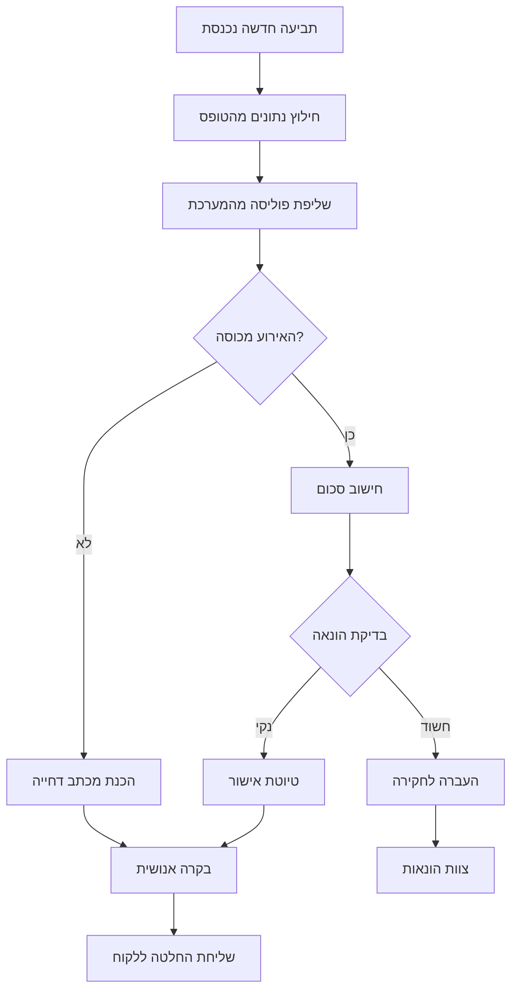
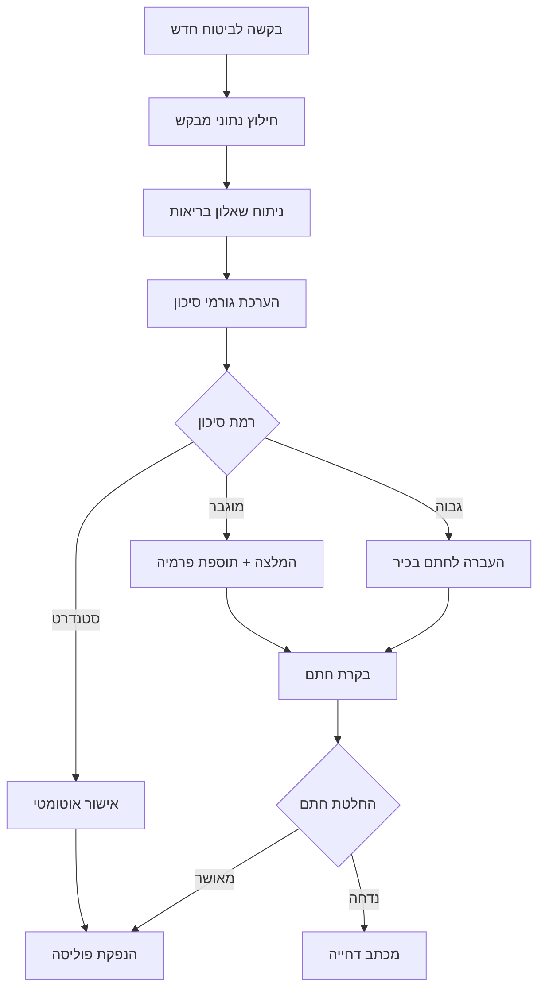
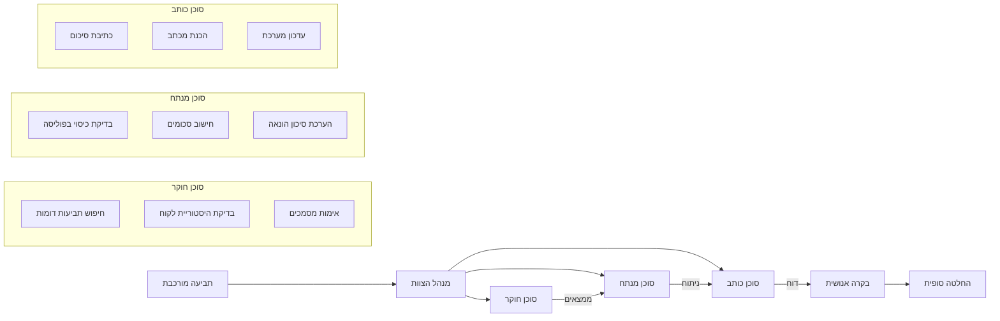
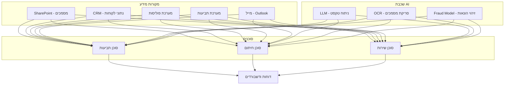

# דיאגרמות ארכיטקטורה - סוכני AI לביטוח

## 1. סוכן עיבוד תביעות

```mermaid
flowchart TD
    A[תביעה חדשה נכנסת] --> B[חילוץ נתונים מהטופס]
    B --> C[שליפת פוליסה מהמערכת]
    C --> D{האירוע מכוסה?}
    D -->|כן| E[חישוב סכום]
    D -->|לא| F[הכנת מכתב דחייה]
    E --> G{בדיקת הונאה}
    G -->|נקי| H[טיוטת אישור]
    G -->|חשוד| I[העברה לחקירה]
    H --> J[בקרה אנושית]
    F --> J
    I --> K[צוות הונאות]
    J --> L[שליחת החלטה ללקוח]
```

## 2. סוכן חיתום

```mermaid
flowchart TD
    A[בקשה לביטוח חדש] --> B[חילוץ נתוני מבקש]
    B --> C[ניתוח שאלון בריאות]
    C --> D[הערכת גורמי סיכון]
    D --> E{רמת סיכון}
    E -->|סטנדרט| F[אישור אוטומטי]
    E -->|מוגבר| G[המלצה + תוספת פרמיה]
    E -->|גבוה| H[העברה לחתם בכיר]
    F --> I[הנפקת פוליסה]
    G --> J[בקרת חתם]
    H --> J
    J --> K{החלטת חתם}
    K -->|מאושר| I
    K -->|נדחה| L[מכתב דחייה]
```

## 3. צוות סוכנים (CrewAI Architecture)

```mermaid
flowchart LR
    A[תביעה מורכבת] --> B[מנהל הצוות]
    B --> C[סוכן חוקר]
    B --> D[סוכן מנתח]
    B --> E[סוכן כותב]
    C -->|ממצאים| D
    D -->|ניתוח| E
    E -->|דוח| F[בקרה אנושית]
    F --> G[החלטה סופית]

    subgraph "סוכן חוקר"
        C1[חיפוש תביעות דומות]
        C2[בדיקת היסטוריית לקוח]
        C3[אימות מסמכים]
    end

    subgraph "סוכן מנתח"
        D1[בדיקת כיסוי בפוליסה]
        D2[חישוב סכומים]
        D3[הערכת סיכון הונאה]
    end

    subgraph "סוכן כותב"
        E1[כתיבת סיכום]
        E2[הכנת מכתב]
        E3[עדכון מערכת]
    end
```

## 4. ארכיטקטורת אינטגרציה

```mermaid
flowchart TD
    subgraph "מקורות מידע"
        S1[SharePoint - מסמכים]
        S2[CRM - נתוני לקוחות]
        S3[מערכת פוליסות]
        S4[מערכת תביעות]
        S5[מייל - Outlook]
    end

    subgraph "שכבת AI"
        AI1[LLM - ניתוח טקסט]
        AI2[OCR - סריקת מסמכים]
        AI3[Fraud Model - זיהוי הונאות]
    end

    subgraph "סוכנים"
        A1[סוכן תביעות]
        A2[סוכן חיתום]
        A3[סוכן שירות]
    end

    S1 & S2 & S3 & S4 & S5 --> A1 & A2 & A3
    AI1 & AI2 & AI3 --> A1 & A2 & A3
    A1 & A2 & A3 --> R[דוחות ודשבורדים]
```
